<!-- Profile README for github.com/samragyi22 — all assets are self-contained SVG in /assets. No scripts, no external requests. -->

![About me. AI-focused full-stack engineer with production experience across FinTech analytics, e-commerce and career-tech platforms, shipping features end-to-end using MERN, Next.js and modern AI tooling (Claude SDK, MCP, Groq API). Based in Jaipur, India; open to opportunities; always learning. Core capabilities: AI engineering, full-stack development, production engineering, developer experience, problem solving. Timeline: 2025 AI and full-stack engineering, 2026 production software engineering, now building AI and full-stack systems.](assets/about.svg)

![Experience. Software Engineer Intern at Eternz, May 2026 to September 2026: resolved 45+ engineering tickets across frontend and backend as a forward-deployed engineer, built the wallet module and shipped a new checkout feature taking conversion from 1.5% to 3.2%, shipped fixes, performance optimizations and DB query caching to production. AI/Full-stack Engineer Intern at KalviumLabs, September 2025 to May 2026: built an AI-powered FinTech analytics platform on Next.js 16, Claude Haiku 4.5 and an isolated MCP server, enabled natural-language queries with autonomous tool calling, streaming responses, SQL/Python analysis and PDF export, delivered production MERN and PostgreSQL applications and scalable REST APIs, reduced response times from ~500ms to under 200ms through indexing.](assets/experience.svg)

<strong>SCORIK</strong> → <a href="https://github.com/samragyi22/Scorik">github.com/samragyi22/Scorik</a>

![Achievements and credentials. Google The Big Code 2026: top 1,500 of 50,000+ students nationally, advanced to Round 2, invited by Google India for an SWE internship. Class representative leading 50+ students and 3+ workshops. Aarunya 2023 Tech Talk first runner up, MITS Gwalior. Patrika MUN top 10 speaker of 150+. ISRO Science Exhibition CR delegate, 1,500+ attendees. Certifications: Oracle Certified Foundations Associate — Agentic AI; Walmart Advanced Software Engineering Job Simulation (Forage); LeetCode 50 and 100 Days badges 2026. Education: B.Tech Computer Science, Software Product Engineering, JECRC University Kalvium Program, 2024–2028, CGPA 9.59.](assets/achievement.svg)

## Activity

First-party GitHub data — no third-party stat widgets:

[Contribution activity](https://github.com/samragyi22?tab=overview) · [Repositories](https://github.com/samragyi22?tab=repositories) · [Stars](https://github.com/samragyi22?tab=stars)

<a href="https://github.com/samragyi22"><strong>GitHub</strong></a> ·
<a href="https://leetcode.com/u/Samragyi_22/"><strong>LeetCode</strong></a> ·
<a href="mailto:samragyisharma.2226@gmail.com"><strong>Email</strong></a> ·
<a href="https://samragyiportfolio.netlify.app/"><strong>Portfolio</strong></a>

