<!-- Profile README for github.com/samragyi22 — all assets are self-contained SVG in /assets. No scripts, no external requests. -->

<a href="https://github.com/samragyi22"><strong>GitHub</strong></a> ·
<a href="https://leetcode.com/u/Samragyi_22/"><strong>LeetCode</strong></a> ·
<a href="mailto:samragyisharma.2226@gmail.com"><strong>Email</strong></a> ·
<a href="https://samragyiportfolio.netlify.app/"><strong>Portfolio</strong></a>

